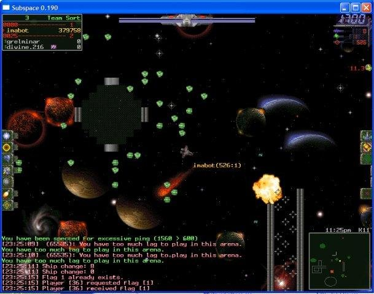
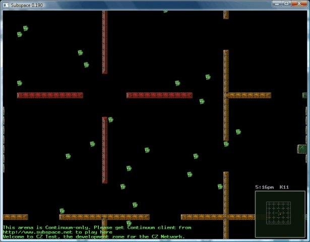

# PSpace

A cross-platform client for Subspace/Continuum game, ported from Windows to work on Linux, macOS, Web (via WebAssembly), and mobile platforms.




## 🚀 Quick Start

### Automated Setup (Recommended)

```bash
# Clone the repository
git clone <your-repo-url>
cd pspace

# Run setup script for your platform
./scripts/setup-linux.sh    # For Ubuntu/Debian
./scripts/setup-macos.sh    # For macOS
# ./scripts/setup-windows.ps1  # For Windows (PowerShell)

# Build the project
./scripts/build.sh

# Run the SDL2 test
cd build && ./test_sdl2
```

### Manual Setup

#### Linux (Ubuntu/Debian)

Install dependencies:

```bash
# Essential build tools
sudo apt install cmake build-essential pkg-config git

# SDL2 and graphics libraries  
sudo apt install libsdl2-dev libsdl2-image-dev libgl1-mesa-dev freeglut3-dev

# Image and audio processing
sudo apt install libpng-dev zlib1g-dev libopenal-dev libalut-dev

```

#### macOS

Install dependencies via Homebrew:

```bash
# Install Homebrew if not already installed
# /bin/bash -c "$(curl -fsSL https://raw.githubusercontent.com/Homebrew/install/HEAD/install.sh)"

brew install cmake sdl2 sdl2_image libpng openal-soft
```

#### Windows

Install dependencies via vcpkg:

```powershell
# Install vcpkg if not already installed
git clone https://github.com/Microsoft/vcpkg.git
.\vcpkg\bootstrap-vcpkg.bat
.\vcpkg\vcpkg integrate install

# Install dependencies
vcpkg install sdl2:x64-windows sdl2-image:x64-windows libpng:x64-windows openal-soft:x64-windows
```

### Building

```bash
# Create and configure build directory
mkdir build
cd build
cmake ..

# Build the project (Linux/macOS)
make -j$(nproc)

# Or use CMake directly (all platforms)
cmake --build . --parallel
```

## 🛠️ VS Code Development

### Recommended Setup

1. **Open project in VS Code**
2. **Install recommended extensions** (you'll be prompted automatically)
   - C/C++ Extension Pack
   - CMake Tools
   - CMake

3. **Build the project**
   - Press `Ctrl+Shift+B` (Cmd+Shift+B on macOS)
   - Or press `Ctrl+Shift+P` → "Tasks: Run Task" → "build"

4. **Run/Debug**
   - Press `F5` to debug the SDL2 test
   - Or press `Ctrl+Shift+P` → "Debug: Start Debugging"

### Available Tasks

- **Build**: `Ctrl+Shift+B` - Builds the entire project
- **Clean**: Removes build artifacts
- **Configure**: Runs CMake configuration

## 🎯 Current Status

- ✅ **CommonGame Library**: Core engine fully ported and working
- ✅ **SDL2 Integration**: Window creation, OpenGL context, input handling
- ✅ **Cross-platform Build**: CMake-based build system for Linux/macOS/Windows
- ✅ **Audio System**: OpenAL integration for cross-platform audio
- ⚠️ **Subspace Application**: Needs refactoring for SDL2 input system
- 🔄 **Web Target**: Future WebAssembly compilation via Emscripten

## 📁 Project Structure

```
pspace/
├── CommonGame/          # Core game engine library
│   ├── *.cpp, *.h      # Game objects, graphics, audio, input handling
│   └── CMakeLists.txt  # Build configuration
├── Subspace/           # Main game application (needs refactoring)
├── scripts/            # Setup and build scripts  
│   ├── setup-linux.sh
│   ├── setup-macos.sh
│   └── build.sh
├── .vscode/            # VS Code configuration
├── test_sdl2.cpp       # SDL2/OpenGL integration test
└── CMakeLists.txt      # Main build configuration
```

## 🧪 Testing

Run the SDL2 integration test:

```bash
cd build
./test_sdl2
```

Expected output:
```
Testing SDL2 initialization...
SDL2/OpenGL initialized successfully!
Test completed successfully!
```

## 🌐 Future Roadmap

1. **Complete Subspace application refactoring** for SDL2 input system
2. **WebAssembly target** via Emscripten for browser gameplay  
3. **Mobile targets** (iOS/Android) using SDL2's mobile support
4. **Modernize OpenGL** from legacy fixed-function to shader-based rendering
5. **Network layer improvements** for modern multiplayer

## 📋 Requirements

- **Linux**: GCC 7+, CMake 3.16+, SDL2 2.0.8+
- **macOS**: Xcode Command Line Tools, CMake 3.16+, SDL2 2.0.8+
- **Windows**: Visual Studio 2019+, CMake 3.16+, vcpkg

## 🤝 Contributing

1. Fork the repository
2. Create a feature branch: `git checkout -b feature/amazing-feature`
3. Make your changes following the existing code style
4. Test your changes: `./scripts/build.sh && cd build && ./test_sdl2`
5. Commit your changes: `git commit -m 'Add amazing feature'`
6. Push to the branch: `git push origin feature/amazing-feature`
7. Open a Pull Request

## 📜 Original Project

The original code and information can be found here:
https://sourceforge.net/projects/pspace/

---

**Note**: The `/build` directory is not tracked in git and will be created automatically when you build the project.
4. Or use the default build task with Ctrl+Shift+B

## Current Status

- ✅ CommonGame library successfully builds on Linux
- ✅ SDL2 integration and cross-platform compatibility layer
- ✅ CMake build system
- ✅ Fixed most OpenGL, PNG, and OpenAL compatibility issues
- ⚠️  Subspace application layer has remaining issues (template problems, missing files)
- ⚠️  Some Windows-specific threading/timing code needs porting

The CommonGame library foundation is now solid and cross-platform compatible. The main application layer still needs work to complete the port.
