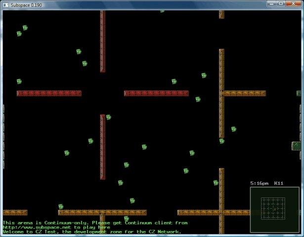

# pspace
A new client for a Subspace / Continuum game for Windows with the goal to port it to mobile platforms.

The goal here would be to move to SDL2 and drop OpenAL to create a platform agnostic release. Likely the OpenGL needs to be changed as well since it's using older gen stuff.

The original code and page can be found here:

https://sourceforge.net/projects/pspace/
